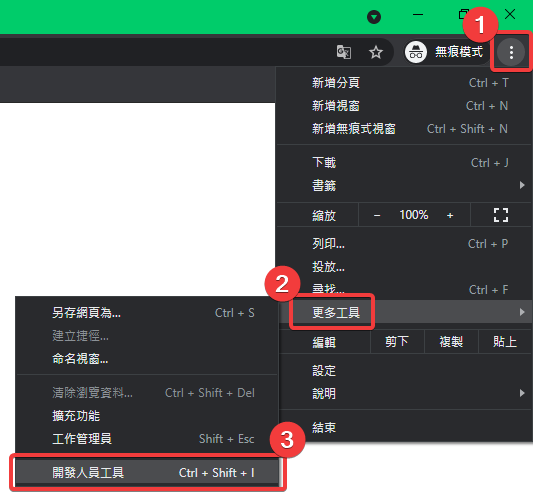
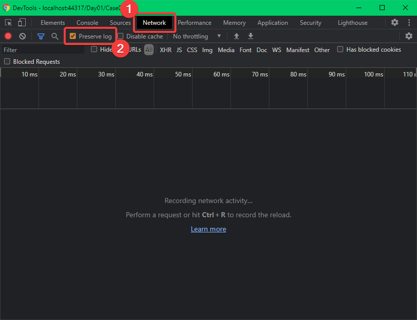

# Day1

## 簡介

想寫這系列文章的目的：

- 蠻多人問 Asp.Net MVC Model Binding 的相關問題，特別是複雜型別
- 自己在工作上碰到多階複雜型別，後來改用 輕前端 Vue 後，覺得值得推薦

系列文章大致的撰寫順序如下：

- 從純 Html Submit Form 至 Asp.Net Core MVC  
  了解 Asp.Net Core MVC 預設的 Model Binding 的規則 !
- 了解基本 Asp.Net Core MVC Html Helper / Tag Helper Render 成 Html 的效果
- 前端動態 新增/刪除 子表項目
  - js 組 html
  - 搭配 ajax + partial
  - 改用輕前端 Vue
- 前端改用 輕前端 Vue 以 Http Post 與 Asp.Net Core 溝通

開發環境

- IDE： JetBrains Rider 2021.1.2
- 專案：
  - 後端
    - .Net 版本： .Net 5
    - 框架：Asp.Net Core MVC / Web API
    - 第三方套件 - NLog
  - 在 MVC 專案內的 View
    - jQuery v3.6.0
    - jQuery UI v1.12.1
    - vue v3.0.x + Compsition API
  - 最終架構
    - 以 Http Get 向 Asp.Net Core 取得 Html
    - 以 Ajax + Http Post 與 Asp.Net Core 溝通

雜項說明：
- 僅介紹預設的 Model Binding 行為
- 會用到 Chrome 開發人員工具，來看 Request 的內容。
- 一開始就先加上 NLog，在開發過程中，會有不小的助益。以這個系列文章來說，Model Binding 失敗時，就可以從 Log 的訊息中，看到官方的建議說明 !
- 會用到 jQuery UI，主要是因應工作上的需要，就練習將 jQuery UI Widgets 包成 vue component，以達成重用的目的 !

## 範例專案

[範例專案連結](https://github.com/ragnakuei/IThomeIron20201/tree/master/Project)

- 為了簡化文章內容
  - 刪除未使用的檔案
  - 簡化 Html 整體結構
  - 會儘量共用 Model，暫時不以最小化 Request / Response 傳輸量，來區分 Http Get / Http Post 所使用的 Models !
- 每篇文章就對應至不同的 Controller

## 預備知識

### 開啟並設定 Chrome 開發人員工具 DevTools

未來會大量使用 Chrome 開發人員工具，來查看 Request 的內容。

如果還不會開啟可以參考以下步驟：

註：之後就以 `DevTools` 來稱呼 Chrome 開發人員工具 !

#### 開啟 Chrome 開發人員工具

  開啟方式有三種：

  - 方式一：

    1. 按下 Chrome 最右上角的`自訂及管理 Google Chrome` (垂直三個點圖示)
    2. 展開`更多工具`
    3. 點擊`開發人員工具`

    

  - 方式二：

    按下快速鍵 \<Ctrl> + \<Shift<> + \<I>

  - 方式三：

    按下快速鍵 \<F12>
    
#### 調整 Chrome 開發人員工具設定

1. 移至 `Network` 頁籤
1. 勾選 `Preserve log`

這樣做的目的是為了保留轉頁後，仍保留轉頁前的 Request / Respose 資料 !