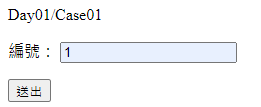
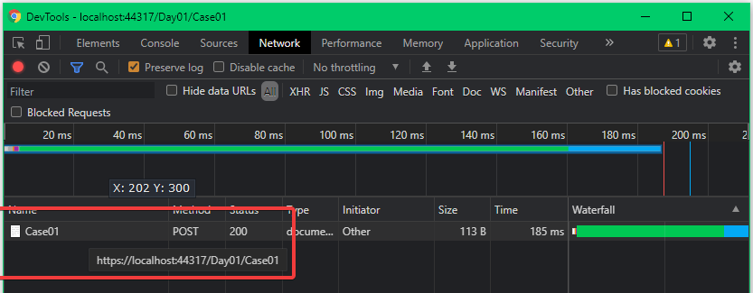
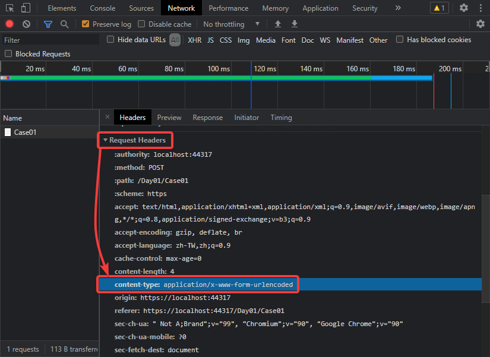
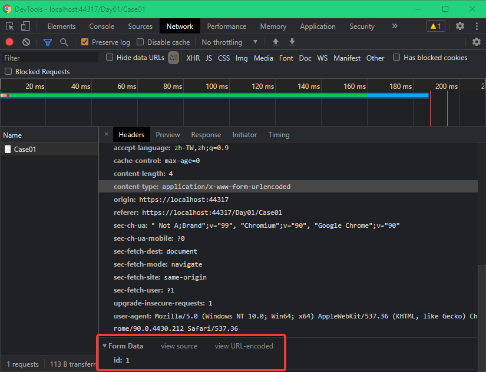
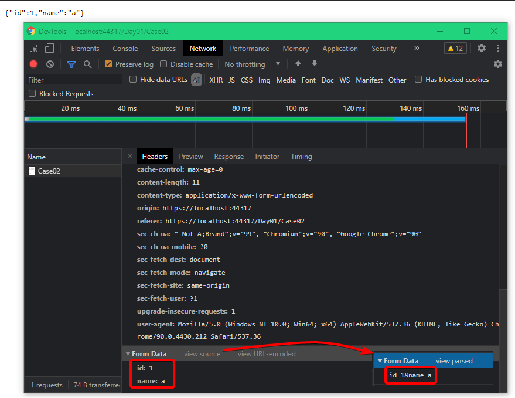
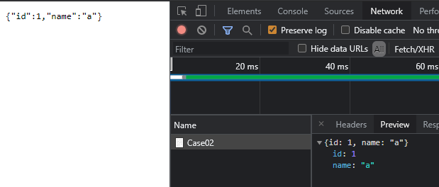

# Day02 - 純 Html 簡單型別 + 字串

[簡單型別定義](https://docs.microsoft.com/en-us/aspnet/core/mvc/models/model-binding#simple-types)

---

## Case01 - 簡單型別

- Controller ：

  預期 post 時，只讀取 id 這個參數的資料

  ```csharp
  [HttpGet]
  public IActionResult Case01()
  {
      return View();
  }

  [HttpPost]
  public IActionResult Case01([FromForm]int id)
  {
      return Ok(id);
  }
  ```

  註：上面 Post Action 的參數加上 [FromForm Attribute](https://docs.microsoft.com/en-us/dotnet/api/microsoft.aspnetcore.mvc.fromformattribute?view=aspnetcore-5.0)，代表會以 Form-Data 格式解析 request body 的內容，並給定至對應的引數上 !

- View

  給定 html 控制項 name 為 id

  ```html
  <form action="/Day01/Case01" method="post">
    <p>
      <label>編號：</label>
      <input type="number" step="1" min="0" name="id" />
    </p>
    <p>
      <button type="submit">送出</button>
    </p>
  </form>
  ```

執行網站後，於該頁面輸入 1 後，按下`送出`來 submit form



從 DevTools Network 可以看到發出的 Request 記錄
以 http post 發出 request 至 /Day01/Case01



Request Header content-type 為 `applicaiton/x-www-form-urlencoded`



Request Body 為 `id:1`
註：這是經過 DevTools parse 過的格式，實際上的格式是 `id=1`，可以按下 view source 來確認 !



轉頁後，看出後端確實收到對應的資料，並顯示出來 !

這邊主要是說：
當 submit form 時，會讀取 form 內控制項的 name，並放到 request body 內，送到後端。
Asp.Net Core 預設的 Model Binding 會以**參數名稱**進行解析 !

---

## Case02 - 字串

- Controller

  跟上個 Case 相比，post Action 做了以下調整：

  - 參數多了一個 name
  - 以 json 格式回傳所傳入的參數

  ```csharp
  [HttpGet]
  public IActionResult Case02()
  {
      return View();
  }

  [HttpPost]
  public IActionResult Case02([FromForm]int id, [FromForm]string name)
  {
      return Ok(new { id, name });
  }
  ```

- View

  在 form tag 新增 name 為 name 的 html 控制項

  ```html
  <form action="/Day01/Case02" method="post">
    <p>
      <label>編號：</label>
      <input type="number" step="1" min="0" name="id" />
    </p>
    <p>
      <label>姓名：</label>
      <input type="text" name="name" />
    </p>
    <p>
      <button type="submit">送出</button>
    </p>
  </form>
  ```

執行網站後，於該頁面輸入資料，按下`送出`

從 DevTools 看出 parsed 及 source 的 request body

以及轉頁後，看出後端確實收到對應的資料，並顯示出來 !



註：關於 post back 後的 json 格式，其大小寫為 camel case，是預設的行為。如果需要改成 pascal case，可參考[這個](https://www.dotblogs.com.tw/Null/2020/05/29/165723)做法來調整。



再次強調：當 submit form 時，會讀取 form 內控制項的 name，並放到 request body 內，送到目的地去 !

---

這篇先到這裡，下一篇來看`複雜型別 object` 的 model binding
