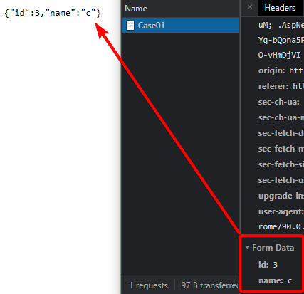
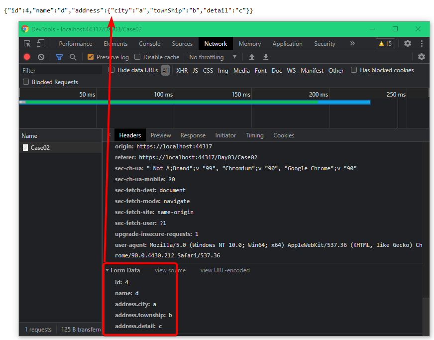

# Day03 - 純 Html 複雜型別 object

[複雜型別定義](https://docs.microsoft.com/en-us/aspnet/core/mvc/models/model-binding#complex-types)

複雜型別我拆成三篇

- object
- collection
- object + collection

這篇先提 object 部份

---

## Case01

此範例跟上一篇範例 Case02 只差在 post Action 參數改用 class 來承接，其餘沒有明顯差異 !

- Controller

  ```csharp
  [HttpPost]
  public IActionResult Case01([FromForm]ViewModel01 vm)
  {
      return Ok(vm);
  }
  ```

- ViewModel

  ```csharp
  public class ViewModel01
  {
      /// <summary>
      /// 編號
      /// </summary>
      public int Id { get; set; }

      /// <summary>
      /// 姓名
      /// </summary>
      public string Name { get; set; }
  }
  ```

網站執行後，在該頁面輸入資料，並 submit form !

由下圖可以看出 request body 的資料，以及後端可以正確回傳原本 submit 的資料 !



---

註：關於 html tag name 大小寫

瀏覽器在 submit form 時，是區分大小寫的

而 Asp.Net Core MVC 預設的 Model Binding 行為，則是不區分大小寫 !

有興趣的人，可以自己試試 !

---

## Case02

- ViewModel

  跟上面 Case 相比 多了一個 Property 為 Address Class

  ```csharp
  public class ViewModel02
  {
      // ...

      /// <summary>
      /// 地址
      /// </summary>
      public Address Address { get; set; }
  }

  public class Address
  {
      /// <summary>
      /// 縣市
      /// </summary>
      public string City { get; set; }

      /// <summary>
      /// 鄉鎮
      /// </summary>
      public string TownShip { get; set; }

      /// <summary>
      /// 詳細
      /// </summary>
      public string Detail { get; set; }
  }
  ```

- View

  html 控制項 name 的格式就要以 `外層 property name` `.` `內層 propety name` 這個格式來給定 !

  ```html
  ...

  <div>
    <p>地址</p>

    <p>
      <label>縣市：</label>
      <input type="text" name="address.city" />
    </p>
    <p>
      <label>鄉鎮：</label>
      <input type="text" name="address.township" />
    </p>
    <p>
      <label>詳細地址：</label>
      <input type="text" name="address.detail" />
    </p>
  </div>

  ...
  ```

網站執行後，在該頁面輸入資料，並 submit form !

由下圖可以看出 request body 的資料，以及後端可以正確回傳原本 submit 的資料 !



---

這篇先到這裡，下一篇來看`複雜型別 collection` 的 model binding
