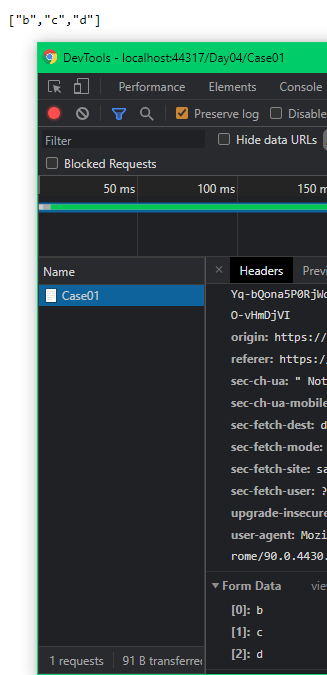

# Day04 - 複雜型別 collection

## Case01

- Controller

    ```csharp
    [HttpPost]
    public IActionResult Case01([FromForm]string[] strs)
    {
        return Ok(strs);
    }
    ```

- View

    collection name 的格式，用 `[index]` 這個格式，且 index 必須是連續

    ```html
    <form action="/Day04/Case01"
        method="post">
        <div>
            <p>訂單項目</p>
            <p>
                <label>項目1：</label>
                <input type="text"
                       name="[0]">
            </p>
            <p>
                <label>項目2：</label>
                <input type="text"
                       name="[1]">
            </p>
            <p>
                <label>項目3：</label>
                <input type="text"
                       name="[2]">
            </p>
        </div>
        <p>
            <button type="submit">送出</button>
        </p>
    </form>
    ```

網站執行後，在該頁面輸入資料，並 submit form !

由下圖可以看出 request body 的資料，以及後端可以正確回傳原本 submit 的資料 !



Collection 的資料型態，只要是 ICollection\<T> 及衍生的型態 都支援 !

這個做法有一個要注意的點是，如果 index 不連續，後面的資料會 binding 不到 !

---

這篇先到這裡，下一篇來看`複雜型別 object + collection` 的 model binding 