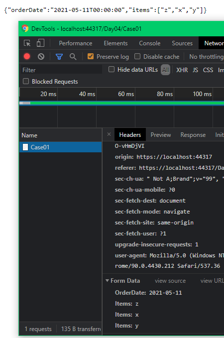
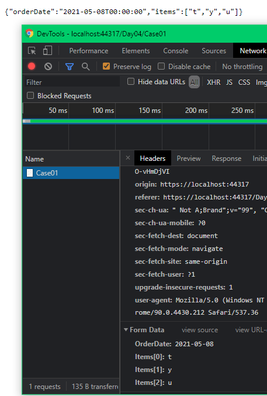
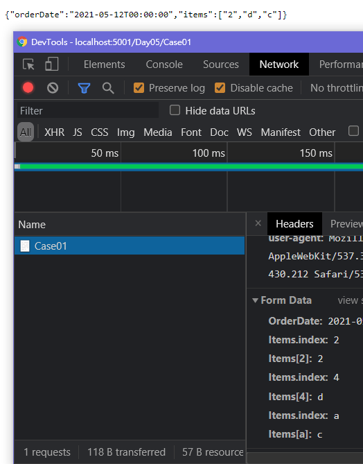

# Day05 - 複雜型別 object + collection

object + collection 指的是 object 裡面的某 Property 的資料型態為 collection

本篇 

- Controller

  Action Name 為各 Case 的編號命名

  ```csharp
  [HttpGet]
  public IActionResult Case01()
  {
      return View();
  }

  [HttpPost]
  public IActionResult Case01([FromForm]ViewModel vm)
  {
      return Ok(vm);
  }
  ```

- ViewModel

    ```csharp
    public class ViewModel
    {
        public DateTime? OrderDate { get; set; }

        public string[] Items { get; set; }
    }
    ```

依照 View 的差異，拆成不同 Case 來看 !

---

## Case01

- View

  要讓 Asp.Net Core MVC Model Binding 至 object 內的 collection

  給定 collection property name 統一的 name 就可以了 !

  ```html
  <form action="/Day05/Case01" method="post">
    <p>
      <label>訂單日期：</label>
      <input type="date" name="OrderDate" />
    </p>
    <div>
      <p>訂單項目</p>
      <p>
        <label>項目1：</label>
        <input type="text" name="Items" />
      </p>
      <p>
        <label>項目2：</label>
        <input type="text" name="Items" />
      </p>
      <p>
        <label>項目3：</label>
        <input type="text" name="Items" />
      </p>
    </div>
    <p>
      <button type="submit">送出</button>
    </p>
  </form>
  ```

網站執行後，在該頁面輸入資料，並 submit form !

由下圖可以看出 request body 的資料，以及後端可以正確回傳原本 submit 的資料 !



而 ViewModel 的 collection 資料型態，只要是 ICollection\<T> 及衍生的型態 都支援 !

---

## Case02

- View

  要讓 Asp.Net Core MVC Model Binding 至 object 內 collection 的另一個做法

  給定這樣的格式 `collection property name` `[index]`，其中 index 必須是要連續的 !

  ```html
  <form action="/Day05/Case01" method="post">
    <p>
      <label>訂單日期：</label>
      <input type="date" name="OrderDate" />
    </p>
    <div>
      <p>訂單項目</p>
      <p>
        <label>項目1：</label>
        <input type="text" name="Items[0]" />
      </p>
      <p>
        <label>項目2：</label>
        <input type="text" name="Items[1]" />
      </p>
      <p>
        <label>項目3：</label>
        <input type="text" name="Items[2]" />
      </p>
    </div>
    <p>
      <button type="submit">送出</button>
    </p>
  </form>
  ```

網站執行後，在該頁面輸入資料，並 submit form !

由下圖可以看出 request body 的資料，以及後端可以正確回傳原本 submit 的資料 !



但這個做法有一個缺點：

> 只要 index 不連續，就無法 Binding 不連續之後的資料 !

Index 不連續的缺點，可以自行試試 !

---

## Case03

這個 Case 可以用來解決上一個 Case 不連續的問題 !

先來看執行的結構

- View

  ```html
  <form action="/Day05/Case01"
        method="post">
      <p>
          <label>訂單日期：</label>
          <input type="date"
                name="OrderDate">
      </p>
      <div>
          <p>訂單項目</p>
          <p>
              <input type="hidden"
                    name="Items.index"
                    value="2">
              <label>項目1：</label>
              <input type="text"
                    name="Items[2]">
          </p>
          <p>
              <input type="hidden"
                    name="Items.index"
                    value="4">
              <label>項目2：</label>
              <input type="text"
                    name="Items[4]">
          </p>
          <p>
              <input type="hidden"
                    name="Items.index"
                    value="a">
              <label>項目3：</label>
              <input type="text"
                    name="Items[a]">
          </p>
      </div>
      <p>
          <button type="submit">送出</button>
      </p>
  </form>
  ```

網站執行後，在該頁面輸入資料，並 submit form !

由下圖可以看出 request body 的資料，以及後端可以正確回傳原本 submit 的資料 !



要讓 FormData 產生以下的格式


```
PropertyName.index : 特定值
PropertyName[特定值] : PropertyValue
```

- PropertyName 為 Binding ViewModel 的 Property Name
- PropertyValue 為回傳的 Property Value 
- 特定值
  - 特定值是我文章內的說明，我目前找不到對應的關鍵字 !
  - 格式上 - 這個只要是數字或字母，都沒有問題。
    - 我試過用 -- 也是可以 !
  - 二行一組，以`特定值`做為對應 !


針對格式第一行的套用，我的想法是
- 用 hidden 的 input，可以避免干擾 UI ，又可以放在 Form Tag 內
  
簡言之，只要特定值對的上，就可以被 binding 至 collection，所以即使是不連續的 index，仍然可以 binding 完整的資料 !

---

這篇先到這裡，下一篇來看`複雜型別 object + object collection` 的 model binding
