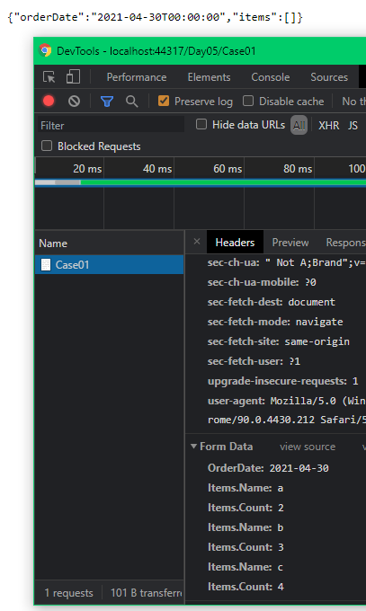
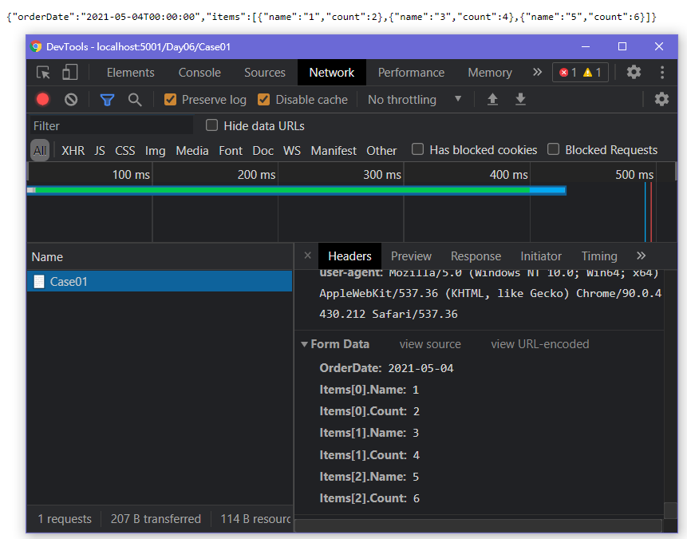
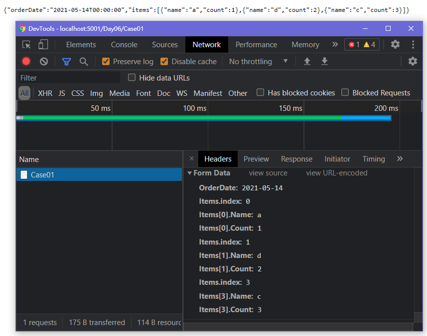

# Day06 - 複雜型別 object + object collection

結合已提到的 object 及 collection 在 Model Binding 的格式說明

很接近多數人在工作中常碰到的挑戰

以資料表結構來看，就是`一主表對多子表`的結構

本篇 

- Controller
  Action Name 為各 Case 的編號命名

    ```csharp
    [HttpGet]
    public IActionResult Case01()
    {
        return View();
    }

    [HttpPost]
    public IActionResult Case01([FromForm]ViewModel vm)
    {
        return Ok(vm);
    }
    ```

- ViewModel

    ```csharp
    public class ViewModel
    {
        public DateTime? OrderDate { get; set; }

        public OrderItem[] Items { get; set; }
    }

    /// <summary>
    /// 訂單項目
    /// </summary>
    public class OrderItem
    {
        /// <summary>
        /// 名稱
        /// </summary>
        public string Name { get; set; }

        /// <summary>
        /// 數量
        /// </summary>
        public int? Quantity { get; set; }
    }
    ```

---

## Case01

提醒：這個 Case 是 Binding 失敗的 !

- View

    套用上一篇 Case01 提到的格式來給定 name，則 tbody 內的 html 就會是

    ```html
    ...
    <tbody>
        <tr>
            <td>
                <input type="text"
                    name="Items.Name">
            </td>
            <td>
                <input type="text"
                    name="Items.Quantity">
            </td>
        </tr>
        <tr>
            <td>
                <input type="text"
                    name="Items.Name">
            </td>
            <td>
                <input type="text"
                    name="Items.Quantity">
            </td>
        </tr>
        <tr>
            <td>
                <input type="text"
                    name="Items.Name">
            </td>
            <td>
                <input type="text"
                    name="Items.Quantity">
            </td>
        </tr>
    </tbody>
    ...
    ```

網站執行後，在該頁面輸入資料，並 submit form !

由下圖可以看出 request body 的資料，以及後端回傳的資料 !

可以發現 Items Binding 失敗了 !



可以到 bin 執行目錄下找 Log 來看

- 目錄位於 Project\bin\Debug\net5.0\Fiele\Logs\nlog-all-yyyy-MM-dd.log
  - yyyy-MM-dd - 就是指執行程式的日期

其中完整的錯誤訊息如下：

```log
2021-05-22 16:41:57.1340 | 13 | DEBUG | Microsoft.AspNetCore.Mvc.ModelBinding.Binders.ArrayModelBinder | Attempting to bind property 'Project.Models.Day05.ViewModel.Items' of type 'Project.Models.Day05.OrderItem[]' using the name 'Items' in request data ... 
2021-05-22 16:41:57.1340 | 28 | DEBUG | Microsoft.AspNetCore.Mvc.ModelBinding.Binders.ArrayModelBinder | Could not bind to collection using a format like Items=value1&Items=value2 
2021-05-22 16:41:57.1340 | 29 | DEBUG | Microsoft.AspNetCore.Mvc.ModelBinding.Binders.ArrayModelBinder | Attempting to bind model using indices. Example formats include: [0]=value1&[1]=value2, Items[0]=value1&Items[1]=value2, Items.index=zero&Items.index=one&Items[zero]=value1&Items[one]=value2 
2021-05-22 16:41:57.1340 | 24 | DEBUG | Microsoft.AspNetCore.Mvc.ModelBinding.Binders.ComplexObjectModelBinder | Attempting to bind model of type 'Project.Models.Day05.OrderItem' using the name 'Items[0]' in request data ... 
2021-05-22 16:41:57.1492 | 18 | DEBUG | Microsoft.AspNetCore.Mvc.ModelBinding.Binders.ComplexObjectModelBinder | Could not bind to model of type 'Project.Models.Day05.OrderItem' as there were no values in the request for any of the properties. 
2021-05-22 16:41:57.1492 | 14 | DEBUG | Microsoft.AspNetCore.Mvc.ModelBinding.Binders.ArrayModelBinder | Done attempting to bind property 'Project.Models.Day05.ViewModel.Items' of type 'Project.Models.Day05.OrderItem[]'. 
```

擷取關鍵的錯誤訊息：

- 以 `Items=value1&Items=value2` binding collection 會失敗

    ```
    Could not bind to collection using a format like Items=value1&Items=value2
    ```

- 下面訊息提到三種格式
    ```
    Example formats include: [0]=value1&[1]=value2, Items[0]=value1&Items[1]=value2, Items.index=zero&Items.index=one&Items[zero]=value1&Items[one]=value2 
    ```

  1. [0]=value1&[1]=value2
        ```
        上上篇所提到的做法 !
        ```

  2. Items[0]=value1&Items[1]=value2

        ```
        上一篇 Case02 所提到的做法 !
        ```

  3. Items.index=zero&Items.index=one&Items[zero]=value1&Items[one]=value2 

        ```
        上一篇 Case03 所提到的做法 !
        ```

---

## Case02


- View

    套用上一篇 Case02 提到的格式來給定 name，則 tbody 內的 html 就會是

    ```html
    ...
    <tbody>
        <tr>
            <td>
                <input type="text"
                    name="Items[0].Name">
            </td>
            <td>
                <input type="number"
                    step="1"
                    min="0"
                    name="Items[0].Quantity">
            </td>
        </tr>
        <tr>
            <td>
                <input type="text"
                    name="Items[1].Name">
            </td>
            <td>
                <input type="number"
                    step="1"
                    min="0"
                    name="Items[1].Quantity">
            </td>
        </tr>
        <tr>
            <td>
                <input type="text"
                    name="Items[2].Name">
            </td>
            <td>
                <input type="number"
                    step="1"
                    min="0"
                    name="Items[2].Quantity">
            </td>
        </tr>
    </tbody>
    ...
    ```

網站執行後，在該頁面輸入資料，並 submit form !

由下圖可以看出 request body 的資料，以及後端可以正確回傳原本 submit 的資料 !



---

## Case03

- View

    套用上一篇 Case03 提到的格式，並打亂 index 來給定 name，則 tbody 內的 html 就會是

    ```html
    ...
    <tbody>
        <tr>
            <input type="hidden"
                name="Items.index"
                value="0">
            <td>
                <input type="text"
                    name="Items[0].Name">
            </td>
            <td>
                <input type="number"
                    step="1"
                    min="0"
                    name="Items[0].Quantity">
            </td>
        </tr>
        <tr>
            <input type="hidden"
                name="Items.index"
                value="1">
            <td>
                <input type="text"
                    name="Items[1].Name">
            </td>
            <td>
                <input type="number"
                    step="1"
                    min="0"
                    name="Items[1].Quantity">
            </td>
        </tr>
        <tr>
            <input type="hidden"
                name="Items.index"
                value="3">
            <td>
                <input type="text"
                    name="Items[3].Name">
            </td>
            <td>
                <input type="number"
                    step="1"
                    min="0"
                    name="Items[3].Quantity">
            </td>
        </tr>
    </tbody>
    ...
    ```

網站執行後，在該頁面輸入資料，並 submit form !

由下圖可以看出 request body 的資料，以及後端可以正確回傳原本 submit 的資料 !



這個語法比較特殊，之後會在前端動態新增/刪除的文章中再次使用 !

---

這篇先到這裡，下一篇來看 如何搭配 Html Helper 來產生符合預期的 name 格式 !