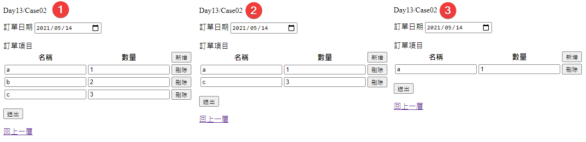

# Day13 - 動態 新增/刪除 Collection 項目(一)

延續上一篇的 ViewModel 結構
現在假設使用者提出要動態 新增/刪除 Collection 項目的需求
就可能碰到的問題拆成多個 Case 來看

接下來開始著重於之前強調的 Model Binding，所以文章內就不提 render 後的 html !

這篇先從大家常用的手法新增/刪除 Collection 項目：

> 在 js 產生 html 來新增 以及 刪除指定的 Html dom !

---

## Case01

加入`新增`的功能 !

修改 Controller 內的 Action 內容如下：

- Get Case01 時，不給定 ViewModel 的預設值

  ```csharp
  [HttpGet]
  public IActionResult Case01()
  {
      return View();
  }
  ```

修改 View 內容如下：

- 加入`新增`的功能 !

  - Table thead 最右邊加上一欄，放上`新增`按鈕

    ```html
    <button type="button" onclick="AddItem(event)">新增</button>
    ```

  - Table tbody 最右邊加上一欄

    ```html
    <td></td>
    ```

  - 最下面加上 Section Script

    ```html
    @section Scripts {
    <script>

          window.ItemsCount = @(Model?.Items?.Length ?? 0);

          window.ItemHtml = `
      <tr>
          <td>
              <input type="text"
                  name="Items[i].Name" />
          </td>
          <td>
              <input type="number"
                  step=1
                  min=0
                  name="Items[i].Quantity" />
          </td>
          <td>
          </td>
      </tr>
          `;

          window.AddItem = function () {
              const itemHtml = ItemHtml..replaceAll('[i]', `[${ItemsCount}]`);

              ItemsCount++;

              $('#Items').append(itemHtml);
          }
    </script>
    }
    ```

網站執行後，在該頁面新增訂單項目及輸入資料

submit 後，可以看出資料可以如預期的傳遞 !

---

## Case02

接下來，加入`刪除`的功能 !

- Controller
  - 從 Case01 複製 HttpGet、HttpPost Action，改名成 Case02
- View

  - 從 Case01.cshtml 複製為 Case02.cshtml
  - 修改 Case02.cshtml

    - 把 Table tbody 最後一列改為以下語法
      ```html
      <td>
        <button type="button" onclick="DeleteItem(event)">刪除</button>
      </td>
      ```
    - 把 js script 內的 window.ItemHtml 變數中，最後一欄，改為上述的語法
    - js script 加上以下刪除的 function

      ```js
      window.DeleteItem = function (e) {
        const btnDom = e.target;

        const trDom = $(btnDom).parent().parent();

        trDom.remove();
      };
      ```

重新編譯並執行網站，開啟剛才新增的頁面

1. 新增三個訂單項目，並輸入資料
2. 刪除中間的訂單項目，按下`送出`按鈕
3. 會發現送出前的第二筆資料不見了 !



在上述第 2 步驟送出前，訂單項目當下的 html 會長這樣
可以發現
第一個項目是 Items[0]
而
第二個項目是 Items[2]

這個 index 不連續的情況，送到後端後，就會發生 Model Binding 部份失敗 !

```html
<tbody id="Items">
  <tr>
    <td>
      <input type="text" name="Items[0].Name" />
    </td>
    <td>
      <input type="number" step="1" min="0" name="Items[0].Quantity" />
    </td>
    <td>
      <button type="button" onclick="DeleteItem(event)">刪除</button>
    </td>
  </tr>

  <tr>
    <td>
      <input type="text" name="Items[2].Name" />
    </td>
    <td>
      <input type="number" step="1" min="0" name="Items[2].Quantity" />
    </td>
    <td>
      <button type="button" onclick="DeleteItem(event)">刪除</button>
    </td>
  </tr>
</tbody>
```

查看 Log ，會發現找不到 Items[1] 後，就等於完成該 Property 的 Binding 了 !

```log
2021-05-25 16:32:49.5225 | 25 | DEBUG | Microsoft.AspNetCore.Mvc.ModelBinding.Binders.ComplexObjectModelBinder | Done attempting to bind model of type 'Project.Models.Day13.OrderItem' using the name 'Items[0]'.
2021-05-25 16:32:49.5225 | 24 | DEBUG | Microsoft.AspNetCore.Mvc.ModelBinding.Binders.ComplexObjectModelBinder | Attempting to bind model of type 'Project.Models.Day13.OrderItem' using the name 'Items[1]' in request data ...
2021-05-25 16:32:49.5387 | 18 | DEBUG | Microsoft.AspNetCore.Mvc.ModelBinding.Binders.ComplexObjectModelBinder | Could not bind to model of type 'Project.Models.Day13.OrderItem' as there were no values in the request for any of the properties.
2021-05-25 16:32:49.5387 | 14 | DEBUG | Microsoft.AspNetCore.Mvc.ModelBinding.Binders.ArrayModelBinder | Done attempting to bind property 'Project.Models.Day13.ViewModel.Items' of type 'Project.Models.Day13.OrderItem[]'.
```

調整方式，請看 Case03

---

## Case03

完整的 Code 可以看看 Github 範例

主要就是參考 Day05.Case03 的格式來調整

- 在每個 tbody tr 中加上

  ```html
  <input type="hidden" name="Items.index" value="@(i)" />
  ```

- js script 的 ItemHtml 變數也加上類似上面的語法

  ```html
  <input type="hidden" name="Items.index" value="i" />
  ```
- js script 的 AddItem 改為以下

  ```js
  window.AddItem = function () {
      const itemHtml = ItemHtml.replaceAll('[i]', `[${ItemsCount}]`)
                               .replaceAll('value="i"', `value="${ItemsCount}"`);
      ItemsCount++;
  
      $('#Items').append(itemHtml);
  }
  ```

讓原本的 html 及動態新增的 html 都能加上 name 為 Items.index & value 為指定值 的項目

就可以解決 Case02 因 index 不連續而導致 Model Binding 部份失敗 !

---

以 Case03 的 Code 來說，針對以下二點
1. 訂單項目 Html 的部份，我不想維護二份 Code
2. 不想在 js 裡面組 html

接下來，我會改用另一個做法來做 !

這篇先到這裡，下一篇來看 `動態 新增/刪除 Collection 項目 (二)` !
