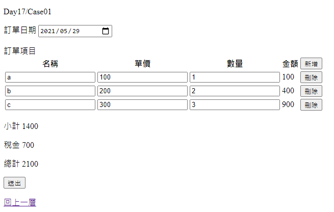

# Day17 - 進入輕前端 Vue 前的範例

這篇主要整合以下幾點來實作
- Tag Helper
- 動態 新增/刪除 訂單項目
- 後端加上計算功能

方便之後與輕前端 Vue 的版本做個比較 !

---

## Case01

延續前一次的範例

- 後端變更

  - ViewModel 新增欄位

      ```csharp
      public class ViewModel
      {
          // ...

          [Display(Name = "小計")]
          public decimal? SubTotalAmount { get; set; }

          [Display(Name = "稅金")]
          public decimal? Tax { get; set; }

          [Display(Name = "總計")]
          public decimal? TotalAmount { get; set; }
      }

      public class OrderItem
      {
          // ...

          /// <summary>
          /// 單價
          /// </summary>
          [Display(Name = "單價")]
          public decimal? UnitPrice { get; set; }

          // ...

          /// <summary>
          /// 金額
          /// </summary>
          [Display(Name = "金額")]
          public decimal? Amount { get; set; }
      }
      ```

  - Contoller 新增計算功能 Action

      ```csharp
      [HttpPost, Route("api/[controller]/[action]")]
      [ValidateAntiForgeryToken]
      public IActionResult Calculate([FromForm]ViewModel vm)
      {
          if (vm?.Items?.Length > 0 == false)
          {
              return Ok(vm);
          }

          vm.SubTotalAmount = 0;
          foreach (var item in vm.Items)
          {
              item.Amount = item.UnitPrice * item.Quantity;

              vm.SubTotalAmount += item.Amount.GetValueOrDefault();;
          }

          vm.Tax         = vm.SubTotalAmount * 0.05m;
          vm.TotalAmount = vm.SubTotalAmount * 1.05m;

          return Ok(vm);
      }
      ```

- 前端變更

  - Case01.cshtml

      ```html

      ...

        <th>
            <label asp-for="Items.FirstOrDefault().UnitPrice"></label>
        </th>

      ...

        <th>
            <label asp-for="Items.FirstOrDefault().Amount"></label>
        </th>

      ...

        <p>
            <label asp-for="SubTotalAmount"></label>
            <label>@(Model?.SubTotalAmount)</label>
            <input type="hidden"
                   readonly
                   asp-for="SubTotalAmount" />
        </p>
        <p>
            <label asp-for="Tax"></label>
            <label>@(Model?.Tax)</label>
            <input type="hidden"
                   readonly
                   asp-for="Tax" />
        </p>
        <p>
            <label asp-for="TotalAmount"></label>
            <label>@(Model?.TotalAmount)</label>
            <input type="hidden"
                   readonly
                   asp-for="TotalAmount" />
        </p>
      ...
      ```
  - OrderItem.cshtml

    ```html
    ...

        <td>
            <input type="number"
                name="Items[@(itemIndex)].UnitPrice"
                step=1
                min=0
                onblur="Calculate()"
                asp-for="UnitPrice" />
        </td>
        
    ...

        <td>
            <label>@(Model?.Amount)</label>
            <input type="hidden"
                readonly
                name="Items[@(itemIndex)].Amount"
                asp-for="Amount" />
        </td>

    ...
    ```


  - js 部份

      ```js

      // ...

      window.CalculateUrl = '@Url.Action("Calculate")';

      // ...

      window.Calculate = function () {

          fetch(CalculateUrl, {
              method: 'POST',
              headers: {
                  'Content-Type': 'application/x-www-form-urlencoded',
                  'RequestVerificationToken': AntiForgeryToken,
              },
              body: $('form').serialize(),
              })
          .then(response => response.json())
          .then(data => {
              RenewAmounts(data);
          })
      }

      window.RenewAmounts = function (viewModel) {

          $('#Items > tr > td > input[name$="Amount"]').each( (index,dom) => {
              const amount = viewModel?.Items[index]?.Amount;

              $(dom)?.val(amount)
                      ?.prev()?.text(amount);
          });

          $('#SubTotalAmount')?.val(viewModel?.SubTotalAmount)
                              ?.prev()?.text(viewModel?.SubTotalAmount);

          $('#Tax')?.val(viewModel?.Tax)
                      ?.prev()?.text(viewModel?.Tax);

          $('#TotalAmount')?.val(viewModel?.TotalAmount)
                              ?.prev()?.text(viewModel?.TotalAmount);
      }

      // ...
      ```


畫面如下：



---

目前頁面上比較關鍵的實作如下：

1. 前端動態 新增/刪除 訂單項目
2. 透過 partal view 減少維護 html 成本
3. 在 單價 / 數量 onblur 時，就會拋到後端進行計算
4. 後端計算完畢後，再把計算結果放回畫面上

之後等輕前端的部份介紹完畢後，再回頭過來跟這個範例的語法進行比較 !

這篇先到這裡，下一篇開始進入 輕前端 Vue 這個部份 !

